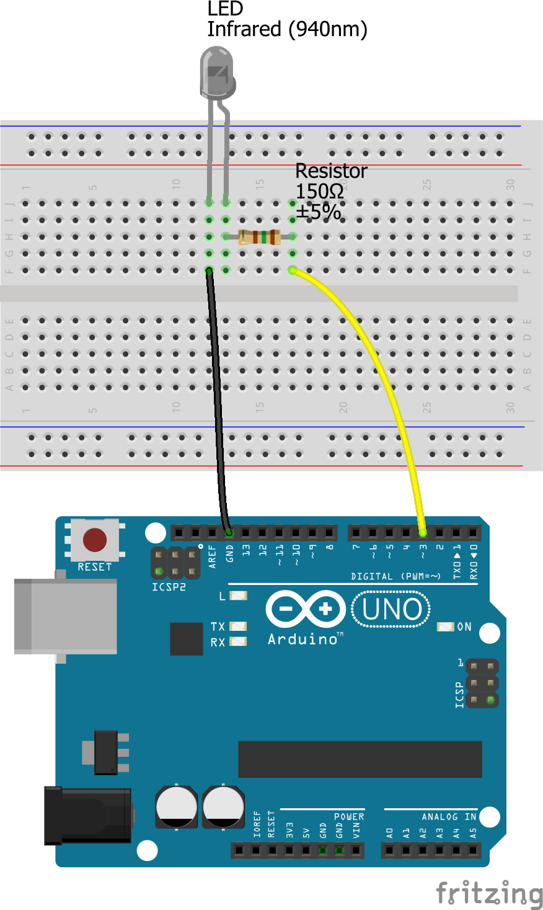

# Arduino IR codes for the remote control of the Peugeot 406 multi-functional LCD display type "C"

## 🎈 Description

Here is an Arduino sketch that you can upload to an Arduino Uno, to operate the multi-functional LCD display (MFD) type "C" as found in Peugeots model 406:

The MFD type "C" does not have buttons and can only be operated with an infrared remote control. Unfortunately, these remote-control units often get lost, making it no longer possible to use set the date and time.

These MFDs are pretty picky about the timing of the IR signals, but after a few hours of experimenting I found the correct timings, which have proven to work every time I tested.

You need to install the library '[IRremote](https://github.com/z3t0/Arduino-IRremote)' in the Arduino IDE (menu 'Sketch' --> 'Include Library' --> 'Manage Libraries...' then search for "IRremote", click on it and press the 'Install' button. I tested with version 2.4.0 .

With some very simple adaptations it is possible to upload this sketch to an ESP-based board like [Wemos (LOLIN) D1 mini (Lite)](https://www.wemos.cc/en/latest/d1/index.html) . For that you would need to install the library '[IRremoteESP8266](https://github.com/esp8266/Basic/tree/master/libraries/IRremoteESP8266)'; I am using version 1.0.0 but probably a more recent version will work fine.

Have fun with it!

## 🔌 Schematic

## 📖 License 

This sketch is open-source and licensed under the [MIT license](http://opensource.org/licenses/MIT).

Do whatever you like with it, but contributions are appreciated!

## 👀 See also
- https://www.youtube.com/watch?v=cx1Gg2k6fAE